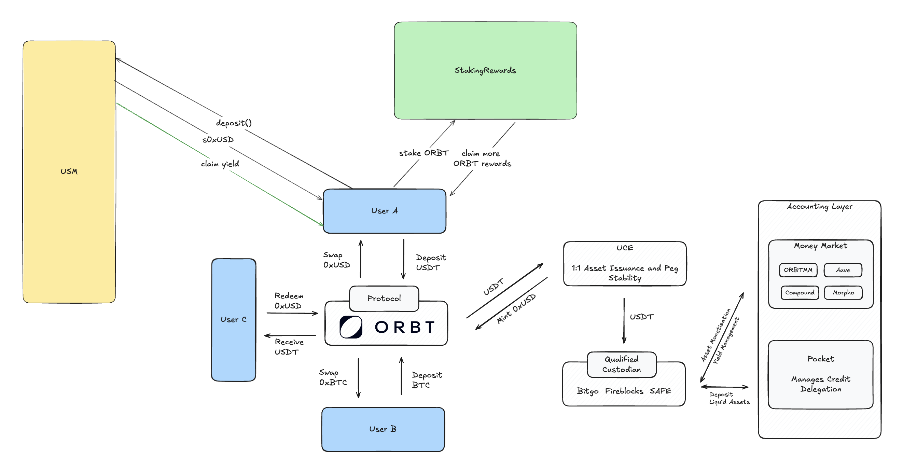

<div align="center">


# ORBT Documentation

[](#start-here)
[](#contracts--interfaces)
[](https://book.getfoundry.sh/)
[](#license)
[](#contributing)
[](#security)
[](#cross-chain-operations)
[](#)

</div>

The ORBT protocol is a unified liquidity and asset management system centered around the Unified Collateral Engine (UCE), User Staking Module (USM), and an execution layer (UPM + Strategies). This index helps you navigate concepts, integration guides, and contract surfaces quickly.

> A unified, security‑first liquidity and asset management protocol for 0xAssets.

---

## Table of Contents

- [Start Here](#start-here)
- [Quick Links](#quick-links)
- [Ecosystem & Install](#ecosystem--install)
- [Concepts](#concepts)
- [Architecture Overview](#architecture-overview)
- [ORBT Landscape Diagram](#orbt-landscape-diagram)
- [Integration APIs](#integration-apis)
- [Contracts & Interfaces](#contracts--interfaces)
- [Cross-Chain Operations](#cross-chain-operations)
- [Economics](#economics)
- [Quantitative Analysis & Risk Modeling](#quantitative-analysis--risk-modeling)
- [Governance](#governance)
- [Operations](#operations)
- [Security](#security)
- [Deployment Status](#deployment-status)
- [Best Practices](#best-practices)
- [FAQ](#faq)
- [Glossary](#glossary)
- [Tutorials](#tutorials)
- [Complete Documentation Index](#complete-documentation-index)
- [Suggested Journeys by Role](#suggested-journeys-by-role)
- [Module Repositories](#module-repositories)
- [Use Cases](#use-cases)
- [Testing & Development](#testing--development)
- [Benchmarked Against](#benchmarked-against)
- [Links & Resources](#links--resources)
- [Community & Support](#community--support)
- [Contributing](#contributing)
- [License](#license)

---

## Start Here

If you are new to ORBT, read these in order:

1. UCE: Unified Collateral Engine — the core swap and credit system
   - concepts: [UCE](concepts/uce.md)
2. USM: User Staking Module — ERC-4626 staking over 0x assets
   - concepts: [USM](concepts/usm.md)
3. UPM & Strategies — execution layer for yield and delegation
   - concepts: [UPM](concepts/upm.md), [Strategies](concepts/strategies.md)
4. Allocator & Pocket — roles, economics, operations
   - concepts: [Allocator](concepts/allocator.md), [Pocket](concepts/pocket.md)
5. Rewards — emissions and distribution
   - concepts: [Rewards](concepts/rewards.md)

Then jump into the relevant Integration Guides below.

> **New to DeFi?** Start with [DeFi Onboarding Tutorial](tutorials/DefiOnboarding.md)  
> **Ready to integrate?** Check [Quickstart Guide](tutorials/Quickstart.md)

---

## Quick Links

- **Concepts → APIs**: [Concepts](#concepts) → [Integration APIs](#integration-apis)
- **API Index**: [api/README.md](api/README.md)
- **Module READMEs**: [UCE](api/uce/README.md) · [UPM](api/upm/README.md) · [Strategies](api/strategies/README.md) · [USM](api/usm/README.md) · [Staking Rewards](api/rewards/README.md)
- **Security**: [Overview](security/overview.md) · [Threat Model](security/threat-model.md) · [Invariants](security/invariants.md)
- **Governance**: [Overview](governance/overview.md) · [Process](governance/process.md) · [Voting](governance/voting.md)
- **Economics**: [Overview](economics/overview.md) · [Fee Structure](economics/fee-structure.md) · [Revenue Distribution](economics/revenue-distribution.md)
- **Operations**: [Monitoring](operations/monitoring.md) · [Allocator Onboarding](operations/allocator-onboarding.md) · [Incident Response](operations/incident-response.md)
- **Cross-Chain**: [Overview](cross-chain/overview.md) · [Across Integration](cross-chain/across-integration.md) · [Bridge Mechanics](cross-chain/bridge-mechanics.md)
- **Reference**: [FAQ](FAQ.md) · [Glossary](glossary.md) · [Best Practices](best-practices.md)

---

## Ecosystem & Install

- Tooling:
  - Foundry (contracts/testing): see [Foundry Book](https://book.getfoundry.sh/)
  - Node.js (optional scripts), a modern wallet
- Quick setup suggestions (for integrators):
  - Always use preview/read-only calls before sending txs
  - Configure ERC-20 approvals with least privilege; prefer permit flows when available

---

## Concepts

[](#concepts) [](#) [](#) [](#)

Core protocol concepts and mechanics. Read these to understand how ORBT works:

- **UCE: Unified Collateral Engine**
  - Swaps across U ↔ 0x and 0x ↔ s0x with oracle/pricing, reserves, and dynamic redemption fees.
  - Read: [concepts/uce.md](concepts/uce.md)

- **USM: User Staking Module (s0x vaults)**
  - ERC‑4626 vaults over 0x assets; shares appreciate via exchange rate and optional rewards.
  - Read: [concepts/usm.md](concepts/usm.md)

- **UPM (User Position Manager)**
  - Stateless orchestrator for single/batch calls from pockets; role-gated access.
  - Read: [concepts/upm.md](concepts/upm.md)

- **UPM & Strategies (Combined)**
  - Orchestrating yield and credit delegation: how UPM and Strategies work together.
  - Read: [concepts/upmAndStrategies.md](concepts/upmAndStrategies.md)

- **Strategies (Money Market & beyond)**
  - Zero-custody adapters with fee-on-profit; supply-only and OCH (credit delegation) modes.
  - Read: [concepts/strategies.md](concepts/strategies.md)

- **Allocator & Pocket**
  - Credit issuers and liquidity partners; manage reserved 0x, pockets, and operational allowances.
  - Read: [concepts/allocator.md](concepts/allocator.md), [concepts/pocket.md](concepts/pocket.md)

- **Rewards**
  - Emissions model, revenue distribution, fairness and risk.
  - Read: [concepts/rewards.md](concepts/rewards.md)

---

## Architecture Overview

```
┌─────────────────────────────────────────────────────────┐
│                     ORBT Protocol                       │
├─────────────────────────────────────────────────────────┤
│  Governance (Timelock + Multisig)                       │
│       │                                                 │
│       ├──► UCE (Swap & Credit)                          │
│       │     • U ↔ 0x oracle-priced; dynamic redemption  │
│       │     • Reserve policy & referral attribution     │
│       │                                                 │
│       ├──► USM (ERC-4626 Vaults)                        │
│       │     • Accumulator-based yield + rewards         │
│       │                                                 |
|       ├──► Staking Rewards (ORBT staking)               │
│       │     • Accumulator-based rewards                 │
│       │                                                 │
│       └──► UPM (Orchestrator) ─► Strategies             │
│             • Batch txs, zero-custody adapters          │
│                                                         │
└─────────────────────────────────────────────────────────┘
```

### ORBT Landscape Diagram



---

## Integration APIs

[](#integration-apis) [](#) [](#) [](#) [](#)

- UCE Swaps Integration
  - guide: [api/uce/docs/IntegrationGuide.md](api/uce/docs/IntegrationGuide.md)
  - interface: [api/uce/IOrbtUCE.sol](api/uce/IOrbtUCE.sol)

- UPM and Strategies Integration (for allocators/integrators)
  - integrator guide: [api/upm/docs/IntegrationGuide.md](api/upm/docs/IntegrationGuide.md)
  - architecture & details: [api/upm/docs/OrbtStrategiesGuide.md](api/upm/docs/OrbtStrategiesGuide.md)
  - UPM interface: [api/upm/IOrbitUPM.sol](api/upm/IOrbitUPM.sol)
  - Strategies: [api/strategies/docs/IntegrationGuide.md](api/strategies/docs/IntegrationGuide.md), [api/strategies/IBaseStrategy.sol](api/strategies/IBaseStrategy.sol), [api/strategies/IOrbtMMStrategy.sol](api/strategies/IOrbtMMStrategy.sol)

- USM / s0x Vaults
  - integration guide: [api/usm/docs/IntegrationGuide.md](api/usm/docs/IntegrationGuide.md)
  - detailed vault README (s0xAsset): [api/usm/readme.md](api/usm/readme.md)
  - interface: [api/usm/IS0xAsset.sol](api/usm/IS0xAsset.sol)

- Staking Rewards (ORBT)
  - integration guide: [api/rewards/docs/IntegrationGuide.md](api/rewards/docs/IntegrationGuide.md)
  - interface: [api/rewards/IStakingRewards.sol](api/rewards/IStakingRewards.sol)
  - module README: [api/rewards/README.md](api/rewards/README.md)

> API index: [api/README.md](api/README.md)

---

## Interfaces

- UCE: [api/uce/IOrbtUCE.sol](api/uce/IOrbtUCE.sol)
- UPM & Strategies: [api/upm/IOrbitUPM.sol](api/upm/IOrbitUPM.sol), [api/strategies/IBaseStrategy.sol](api/strategies/IBaseStrategy.sol), [api/strategies/IOrbtMMStrategy.sol](api/strategies/IOrbtMMStrategy.sol)
- USM: [api/usm/IS0xAsset.sol](api/usm/IS0xAsset.sol)
- Rewards: [api/rewards/IStakingRewards.sol](api/rewards/IStakingRewards.sol)

See full API summaries: [api/README.md](api/README.md)

---

## API Module READMEs (Deep Links)

- UCE: [api/uce/README.md](api/uce/README.md)
- UPM: [api/upm/README.md](api/upm/README.md)
- Strategies: [api/strategies/README.md](api/strategies/README.md)
- USM: [api/usm/README.md](api/usm/README.md)
- Staking Rewards: [api/rewards/README.md](api/rewards/README.md)

---

## Cross-Chain Operations

[](#cross-chain-operations) [](#) [](#)

ORBT supports cross-chain asset flows through integration with bridge protocols like Across. This section covers bridge mechanics, asset flows, multi-chain deployment, and integration patterns.

**Key Topics:**
- Cross-chain architecture and bridge mechanics
- Across protocol integration
- Asset flow patterns and routing
- Multi-chain deployment strategies
- Safety controls and caps

**Documentation:**
- Overview: [cross-chain/overview.md](cross-chain/overview.md) - Introduction to cross-chain operations
- Across Integration: [cross-chain/across-integration.md](cross-chain/across-integration.md) - How ORBT integrates with Across bridge
- Asset Flows: [cross-chain/asset-flows.md](cross-chain/asset-flows.md) - How assets flow cross-chain
- Bridge Mechanics: [cross-chain/bridge-mechanics.md](cross-chain/bridge-mechanics.md) - Technical details of bridge operations
- Multi-Chain Deployment: [cross-chain/multi-chain-deployment.md](cross-chain/multi-chain-deployment.md) - Deployment patterns across chains

---

## Economics

[](#economics) [](#) [](#) [](#)

Complete documentation of ORBT's economic model, including fee structures, revenue distribution, tokenomics, treasury management, and yield sources. Essential for understanding protocol incentives and sustainability.

**Key Topics:**
- Fee structures with mathematical formulas (mint fees, redemption fees, strategy fees)
- Revenue distribution mechanisms and treasury accumulation
- Tokenomics and ORBT token economics
- Treasury model and fund management
- Yield sources and APY mechanics

**Documentation:**
- Overview: [economics/overview.md](economics/overview.md) - Economic model summary
- Fee Structure: [economics/fee-structure.md](economics/fee-structure.md) - Detailed fee calculations and formulas
- Revenue Distribution: [economics/revenue-distribution.md](economics/revenue-distribution.md) - How revenue flows through the protocol
- Tokenomics: [economics/tokenomics.md](economics/tokenomics.md) - ORBT token economics and distribution
- Treasury Model: [economics/treasury-model.md](economics/treasury-model.md) - Treasury accumulation and usage
- Yield Sources: [economics/yield-sources.md](economics/yield-sources.md) - Where protocol yield originates

---

## Quantitative Analysis & Risk Modeling

[](#quantitative-analysis--risk-modeling) [](#) [](#)

Mathematical models, quantitative analysis, and risk frameworks for understanding protocol mechanics at a deeper level. Essential for allocators, risk analysts, and quantitative researchers.

**Key Topics:**
- Reserve policy modeling and optimization
- Fee curve analysis and dynamic fee mechanics
- Credit modeling and debt accumulation
- Risk assessment frameworks

**Documentation:**
- Reserve Policy: [quantitative/reserve-policy.md](quantitative/reserve-policy.md) - Reserve mechanics and policy modeling
- Fee Curves: [quantitative/fee-curves.md](quantitative/fee-curves.md) - Mathematical analysis of fee structures
- Credit Modeling: [quantitative/credit-modeling.md](quantitative/credit-modeling.md) - Credit allocation and debt models

---

## Governance

[](#governance) [](#) [](#)

How ORBT is governed, including parameter updates, voting mechanisms, proposal processes, and governance action types. Critical for understanding protocol changes and decision-making.

**Key Topics:**
- Governance architecture (multisig + timelock)
- Proposal and voting processes
- EIP-712 signature-based governance
- Action types and governance hooks
- Proposal examples and templates

**Documentation:**
- Overview: [governance/overview.md](governance/overview.md) - Governance architecture and roles
- Process: [governance/process.md](governance/process.md) - How governance decisions are made
- Voting: [governance/voting.md](governance/voting.md) - Voting mechanisms and procedures
- Action Types: [governance/action-types.md](governance/action-types.md) - Types of governance actions
- EIP-712 Signatures: [governance/eip-712-signatures.md](governance/eip-712-signatures.md) - Signature-based governance
- Proposal Examples: [governance/proposal-examples.md](governance/proposal-examples.md) - Example governance proposals

---

## Operations

[](#operations) [](#) [](#) [](#)

Operational procedures, monitoring guidelines, and operational best practices for running ORBT infrastructure. Essential for operators, allocators, and protocol maintainers.

**Key Topics:**
- Monitoring metrics and alerting
- Allocator onboarding procedures
- Incident response protocols
- Parameter adjustment workflows
- Governance procedures for operations

**Documentation:**
- Monitoring: [operations/monitoring.md](operations/monitoring.md) - Key metrics and monitoring guidelines
- Allocator Onboarding: [operations/allocator-onboarding.md](operations/allocator-onboarding.md) - Process for onboarding new allocators
- Incident Response: [operations/incident-response.md](operations/incident-response.md) - How to respond to incidents
- Parameter Adjustment: [operations/parameter-adjustment.md](operations/parameter-adjustment.md) - How to adjust protocol parameters
- Governance Procedures: [operations/governance-procedures.md](operations/governance-procedures.md) - Operational governance workflows

---

## Best Practices

[](#best-practices)

Operational and integration best practices for users, allocators, developers, and operators. Guidelines for safe and effective protocol usage.

**Documentation:**
- Best Practices: [best-practices.md](best-practices.md) - Comprehensive best practices guide covering privileged roles, parameter changes, oracles, liquidity management, and upgrades

---

## FAQ

[](#faq)

Frequently asked questions covering common protocol operations, mechanics, and troubleshooting.

**Documentation:**
- FAQ: [FAQ.md](FAQ.md) - Common questions about pauses, swaps, fees, allocator operations, and oracle staleness

---

## Glossary

[](#glossary)

Comprehensive glossary of ORBT terminology, roles, and concepts.

**Documentation:**
- Glossary: [glossary.md](glossary.md) - Definitions for ADMIN, POCKET, UPM, UCE, sOxAsset, Ox, S-Asset, Pocket, Debt Index, Tin, Redemption Fee, and more

---

## Complete Documentation Index

[](#complete-documentation-index)

### Core Concepts

- **UCE**: [concepts/uce.md](concepts/uce.md) - Unified Collateral Engine mechanics
- **USM**: [concepts/usm.md](concepts/usm.md) - User Staking Module and s0x vaults
- **UPM**: [concepts/upm.md](concepts/upm.md) - User Position Manager orchestrator
- **UPM & Strategies**: [concepts/upmAndStrategies.md](concepts/upmAndStrategies.md) - Combined UPM and Strategies overview
- **Strategies**: [concepts/strategies.md](concepts/strategies.md) - Strategy adapters and mechanics
- **Allocator**: [concepts/allocator.md](concepts/allocator.md) - Allocator roles and credit management
- **Pocket**: [concepts/pocket.md](concepts/pocket.md) - Pocket custody and routing
- **Rewards**: [concepts/rewards.md](concepts/rewards.md) - Rewards distribution and emissions

### Integration APIs

- **API Index**: [api/README.md](api/README.md) - Complete API reference
- **UCE API**
  - Integration Guide: [api/uce/docs/IntegrationGuide.md](api/uce/docs/IntegrationGuide.md)
  - Errors: [api/uce/docs/errors.md](api/uce/docs/errors.md)
  - Events: [api/uce/docs/events.md](api/uce/docs/events.md)
  - Interface: [api/uce/IOrbtUCE.sol](api/uce/IOrbtUCE.sol)
  - README: [api/uce/README.md](api/uce/README.md)
- **UPM API**
  - Integration Guide: [api/upm/docs/IntegrationGuide.md](api/upm/docs/IntegrationGuide.md)
  - Strategies Guide: [api/upm/docs/OrbtStrategiesGuide.md](api/upm/docs/OrbtStrategiesGuide.md)
  - Interface: [api/upm/IOrbitUPM.sol](api/upm/IOrbitUPM.sol)
  - README: [api/upm/README.md](api/upm/README.md)
- **Strategies API**
  - Integration Guide: [api/strategies/docs/IntegrationGuide.md](api/strategies/docs/IntegrationGuide.md)
  - Errors: [api/strategies/docs/errors.md](api/strategies/docs/errors.md)
  - Events: [api/strategies/docs/events.md](api/strategies/docs/events.md)
  - Base Interface: [api/strategies/IBaseStrategy.sol](api/strategies/IBaseStrategy.sol)
  - Money Market Interface: [api/strategies/IOrbtMMStrategy.sol](api/strategies/IOrbtMMStrategy.sol)
  - README: [api/strategies/README.md](api/strategies/README.md)
- **USM API**
  - Integration Guide: [api/usm/docs/IntegrationGuide.md](api/usm/docs/IntegrationGuide.md)
  - Errors: [api/usm/docs/errors.md](api/usm/docs/errors.md)
  - Events: [api/usm/docs/events.md](api/usm/docs/events.md)
  - Interface: [api/usm/IS0xAsset.sol](api/usm/IS0xAsset.sol)
  - README: [api/usm/README.md](api/usm/README.md)
- **Staking Rewards API**
  - Integration Guide: [api/rewards/docs/IntegrationGuide.md](api/rewards/docs/IntegrationGuide.md)
  - Errors: [api/rewards/docs/errors.md](api/rewards/docs/errors.md)
  - Events: [api/rewards/docs/events.md](api/rewards/docs/events.md)
  - Interface: [api/rewards/IStakingRewards.sol](api/rewards/IStakingRewards.sol)
  - README: [api/rewards/README.md](api/rewards/README.md)

### Cross-Chain Documentation

- **Overview**: [cross-chain/overview.md](cross-chain/overview.md)
- **Across Integration**: [cross-chain/across-integration.md](cross-chain/across-integration.md)
- **Asset Flows**: [cross-chain/asset-flows.md](cross-chain/asset-flows.md)
- **Bridge Mechanics**: [cross-chain/bridge-mechanics.md](cross-chain/bridge-mechanics.md)
- **Multi-Chain Deployment**: [cross-chain/multi-chain-deployment.md](cross-chain/multi-chain-deployment.md)

### Economics Documentation

- **Overview**: [economics/overview.md](economics/overview.md)
- **Fee Structure**: [economics/fee-structure.md](economics/fee-structure.md)
- **Revenue Distribution**: [economics/revenue-distribution.md](economics/revenue-distribution.md)
- **Tokenomics**: [economics/tokenomics.md](economics/tokenomics.md)
- **Treasury Model**: [economics/treasury-model.md](economics/treasury-model.md)
- **Yield Sources**: [economics/yield-sources.md](economics/yield-sources.md)

### Quantitative & Risk Analysis

- **Reserve Policy**: [quantitative/reserve-policy.md](quantitative/reserve-policy.md)
- **Fee Curves**: [quantitative/fee-curves.md](quantitative/fee-curves.md)
- **Credit Modeling**: [quantitative/credit-modeling.md](quantitative/credit-modeling.md)

### Governance Documentation

- **Overview**: [governance/overview.md](governance/overview.md)
- **Process**: [governance/process.md](governance/process.md)
- **Voting**: [governance/voting.md](governance/voting.md)
- **Action Types**: [governance/action-types.md](governance/action-types.md)
- **EIP-712 Signatures**: [governance/eip-712-signatures.md](governance/eip-712-signatures.md)
- **Proposal Examples**: [governance/proposal-examples.md](governance/proposal-examples.md)

### Operations Documentation

- **Monitoring**: [operations/monitoring.md](operations/monitoring.md)
- **Allocator Onboarding**: [operations/allocator-onboarding.md](operations/allocator-onboarding.md)
- **Incident Response**: [operations/incident-response.md](operations/incident-response.md)
- **Parameter Adjustment**: [operations/parameter-adjustment.md](operations/parameter-adjustment.md)
- **Governance Procedures**: [operations/governance-procedures.md](operations/governance-procedures.md)

### Security Documentation

- **Overview**: [security/overview.md](security/overview.md)
- **Threat Model**: [security/threat-model.md](security/threat-model.md)
- **Invariants**: [security/invariants.md](security/invariants.md)
- **Access Control**: [security/access-control.md](security/access-control.md)
- **Oracle Security**: [security/oracle-security.md](security/oracle-security.md)
- **Economic Attacks**: [security/economic-attacks.md](security/economic-attacks.md)
- **Bug Bounty**: [security/bug-bounty.md](security/bug-bounty.md)

### Tutorials & Guides

- **Quickstart**: [tutorials/Quickstart.md](tutorials/Quickstart.md)
- **DeFi Onboarding**: [tutorials/DefiOnboarding.md](tutorials/DefiOnboarding.md)

### Reference & Support

- **FAQ**: [FAQ.md](FAQ.md) - Frequently asked questions
- **Glossary**: [glossary.md](glossary.md) - Terminology and definitions
- **Best Practices**: [best-practices.md](best-practices.md) - Operational best practices
- **Changelog**: [CHANGELOG.md](CHANGELOG.md) - Documentation changelog
- **Contributing**: [CONTRIBUTING.md](CONTRIBUTING.md) - Contribution guidelines
- **License**: [LICENSE](LICENSE) - License information

---

## Suggested Journeys by Role

[](#suggested-journeys-by-role) [](#) [](#) [](#)

- Builders / Integrators
  - Read: [UCE](concepts/uce.md) → [UCE Integration](api/uce/docs/IntegrationGuide.md)
  - If staking: [USM concept](concepts/usm.md) → [USM integration](api/usm/docs/IntegrationGuide.md)
  - If incentives: [Rewards concept](concepts/rewards.md) → [Rewards integration](api/rewards/docs/IntegrationGuide.md)

- Allocators / Liquidity Partners
  - Read: [Allocator & Pocket](concepts/allocator.md) → [UPM concept](concepts/upm.md) → [Strategies concept](concepts/strategies.md) → [UPM Integrator Guide](api/upm/docs/IntegrationGuide.md)

- Smart Contract Engineers
  - Skim: [Contracts & Interfaces](#contracts--interfaces) → open the relevant interfaces
  - Reference: [api/README.md](api/README.md)

---

## Module Repositories

[](#module-repositories) [](#) [](#) [](#) [](#)

- UCE (Unified Collateral Engine): Core swap engine and credit allocation
  - Repo: https://github.com/Orbtofficial/uce-v1
- USM (User Staking Module): ERC-4626 yield-bearing vaults for 0x assets
  - Repo: https://github.com/Orbtofficial/usm
- Governance: Timelocked multi-sig parameter updates
  - Repo: https://github.com/Orbtofficial/orbt-governance-v1
- Rewards: ORBT token staking rewards distribution
  - Repo: https://github.com/Orbtofficial/rewards
- UPM (User Position Manager): Stateless transaction orchestrator
  - Repo: https://github.com/Orbtofficial/upm
- Strategies (Core): Strategy base + adapters
  - Repo: https://github.com/Orbtofficial/strategy-core

---

## Use Cases

[](#use-cases) [](#) [](#) [](#)

### User: Earn Yield on Bitcoin

```solidity
// 1. Swap WBTC → 0xBTC
uce.swapExactIn(WBTC, OX_BTC, 1e8, user, 0);

// 2. Stake 0xBTC → s0xBTC (ERC-4626)
IERC4626(s0xBTC).deposit(1e18, user);

// ... accrue yield ...

// 3. Unstake back to 0xBTC
IERC4626(s0xBTC).redeem(shares, user, user);

// 4. Redeem 0xBTC → WBTC if desired
uce.swapExactIn(OX_BTC, WBTC, 1.05e18, user, 0);
```

### Allocator: Provide Professional Liquidity

```solidity
// 1. Governance onboards allocator (off-chain process)
// 2. Admin mints allocator credit
uce.allocatorCreditMint(allocator, 500e18);

// 3. Users swap with allocator referral; U flows to pocket

// 4. Deploy U to Aave via UPM → Strategy
bytes memory data = abi.encodeWithSelector(
    OrbtMMStrategy.supply.selector,
    aToken,
    pocket,
    amount
);
IOrbitUPM(upm).doCall(address(orbtMMStrategy), data);

// 5. Repay debt from earnings over time
uce.allocatorRepay(UNDERLYING, repayAmount);
```

### Developer: Integrate ORBT UCE

```solidity
// Example helper using IOrbtUCE
IOrbtUCE uce;

function swapToOx(address u, address ox, uint256 amountU) external returns (uint256) {
    IERC20(u).approve(address(uce), amountU);
    return uce.swapExactIn(u, ox, amountU, msg.sender, 0);
}
```

---

## Testing & Development

[](#testing--development) [](#) [](#)

- In module repositories (see Module Repositories above):

```bash
# Build
forge build

# Tests
forge test -vv

# Gas report
forge test --gas-report

# Format
forge fmt
```

---

## Security

[](#security) [](#) [](#) [](#)

ORBT employs a multi-layered security approach with comprehensive threat modeling, access controls, and economic attack mitigations.

**Security Documentation:**
- **Overview**: [security/overview.md](security/overview.md) - Security architecture and principles
- **Threat Model**: [security/threat-model.md](security/threat-model.md) - Identified threats and attack vectors
- **Invariants**: [security/invariants.md](security/invariants.md) - Protocol invariants that must be maintained
- **Access Control**: [security/access-control.md](security/access-control.md) - Role-based access control matrices
- **Oracle Security**: [security/oracle-security.md](security/oracle-security.md) - Oracle manipulation protections
- **Economic Attacks**: [security/economic-attacks.md](security/economic-attacks.md) - Economic attack vectors and mitigations
- **Bug Bounty**: [security/bug-bounty.md](security/bug-bounty.md) - Bug bounty program details

### Audit Status

| Auditor | Date | Version | Report | Status |
|---------|------|---------|--------|--------|
| [Pending] | TBD | v1.0.0 | [Link] | 🟡 In Progress |

- **Security contact**: security@orbt.protocol
- **Audit status**: Share reports when available
- **Bug bounty**: Planned; scope and rewards to be published
- **Best practices**: Role-gated entrypoints, nonReentrant strategies, zero-custody invariants

---

## Deployment Status

[](#deployment-status) [](#)

ORBT Protocol is currently in **pre-deployment** phase. The protocol is being developed and audited before mainnet launch.

### Network Status

| Network | Status | Contracts |
|---------|--------|-----------|
| **Ethereum Mainnet** | 🔴 Not Deployed | Coming soon |
| **Sepolia Testnet** | 🟡 Planned | Coming soon |
| **Other Networks** | 🟡 Planned | Coming soon |

**Contract Addresses**: Coming soon after deployment

---

## Benchmarked Against

[](#benchmarked-against)

ORBT Protocol follows best practices from leading DeFi protocols:

| Protocol | Pattern Adopted |
|----------|-----------------|
| **SkyMoney & Spark** | PSM mechanics (UCE swaps) |
| **SkyMoney** | Yield  (Pockets) |
| **Prisma** | Dynamic redemption rates (0xUSD redemption rate) |
| **MakerDAO** | DSR accumulator pattern (USM interest accrual) |
| **Synthetix** | StakingRewards (Rewards module) |
| **Compound** | Timelock governance (Governance module) |
| **Aave** | Supply-only and Credit Delegation integration (Strategies module) |
| **Uniswap** | Documentation structure & repository organization |


---

## Links & Resources

[](#links--resources)

- **Concepts**: [Core Concepts](#concepts)
- **API Index**: [api/README.md](api/README.md)
- **Tutorials**: [tutorials/](tutorials/)
- **Module Repositories**: [Module Repositories](#module-repositories)
- **Economics**: [Economics Documentation](#economics)
- **Security**: [Security Documentation](#security)
- **Governance**: [Governance Documentation](#governance)
- **Cross-Chain**: [Cross-Chain Operations](#cross-chain-operations)
- **Complete Index**: [Complete Documentation Index](#complete-documentation-index)

---

## ⚠️ Disclaimer

This software is provided "as is", without warranty of any kind. Smart contracts hold financial value and may contain bugs. Users interact at their own risk. Please review our [Security Policy](./SECURITY.md) and conduct your own research before using the protocol.

**Audit Status**: Pre-audit. Do not use with real funds until professionally audited.

---

## Community & Support

[](#community--support) [](#) [](#)

- Issues: use the templates under [.github](.github) to report bugs or request docs
- PRs: follow [CONTRIBUTING](.github/CONTRIBUTING.md)
- Security: security@orbt.protocol

---

## 🙏 Acknowledgments

Built with support from:
- OpenZeppelin (security libraries)
- Foundry (development framework)
- The Ethereum community
- Our contributors and advisors

Special thanks to the teams behind MakerDAO, Synthetix, Compound, Aave, and Uniswap for pioneering the patterns and best practices that inspired this protocol.

---

## Contributing

[](#contributing) [](#) [](#)

This repository is focused on **documentation only**. Improvements to docs are welcome. Submit a PR with clear, minimal changes. For larger structure changes, open an issue first to discuss navigation and scope.

**For code contributions**: Please contribute to the respective module repositories (UCE, USM, UPM, Strategies, Governance, Rewards). See [CONTRIBUTING.md](CONTRIBUTING.md) for details.

---

## License

Documentation and example interfaces are provided under the MIT license unless noted otherwise.


